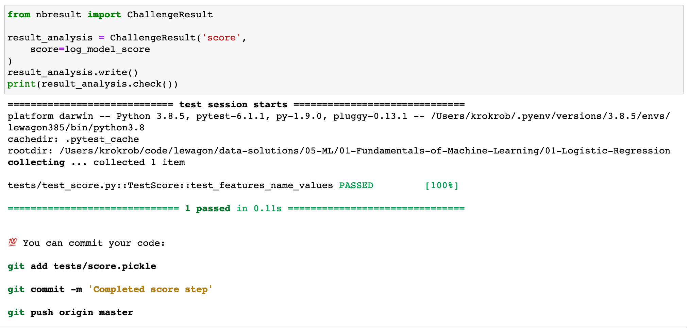

# nbresult

A simple package to test Jupyter notebook result for the Le Wagon's Data Science Bootcamp.

## Installation

Installation with `pip` from GitHub:

```bash
pip install git+https://github.com/lewagon/nbresult.git
```

**OR**

Manual installation:
- Download the package
- Go to the package directory
- Install the package with

```bash
pip install .
```

## Usage

Considering the default data challenge architecture:

```bash
.
├── challenge.ipynb
├── Makefile
├── README.md
├── data
│   └── data.csv
└── tests
    └── __init__.py
```

If you want to test a variable `log_model_score` from the `challenge.ipynb` notebook with `pytest`:


Anywhere in the notebook you can add a cell with the following code:

```python
from nbresult import ChallengeResult

result_analysis = ChallengeResult('score',
    score=log_model_score
)
result_analysis.write()
```

This outputs a `score.pickle` file in the `tests` directory:

```bash
.
├── challenge.ipynb
├── Makefile
├── README.md
├── data
│   └── data.csv
└── tests
    ├── __init__.py
    └── score.pickle
```

Now you would like to write test on the `log_model_score` with `pytest`. Create a `test_score.py` file:

```python
# tests/test_score.py
from nbresult import ChallengeResultTestCase

class TestScore(ChallengeResultTestCase):

    def test_features_name_values(self):
        self.assertEqual(self.result.score > 0.82, True)
```

Finally you can run your tests with `pytest`:

```bash
pytest tests/test_score.py
```


OR

Run the tests with `make`:
- Setup a `Makefile`

```make
# Makefile

default: pytest

pytest:
  PYTHONDONTWRITEBYTECODE=1 pytest -v --color=yes
```

- Run `make`


OR

Run the tests inside the notebook:

```python
from nbresult import ChallengeResult

result_analysis = ChallengeResult('score',
    score=log_model_score
)
result_analysis.write()
print(result.check())
```


