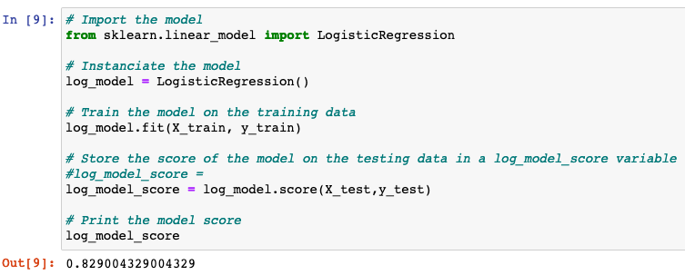
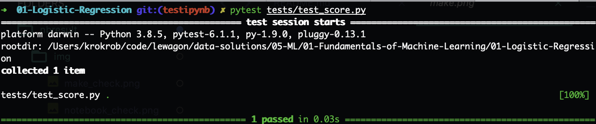
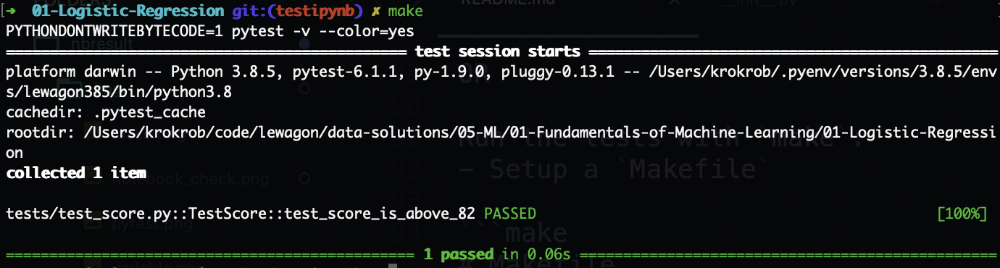
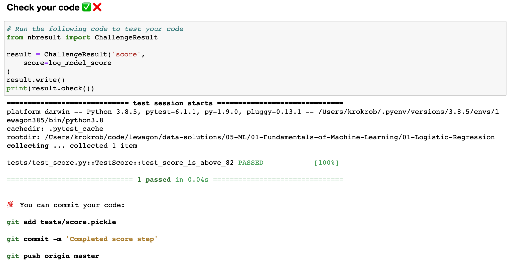
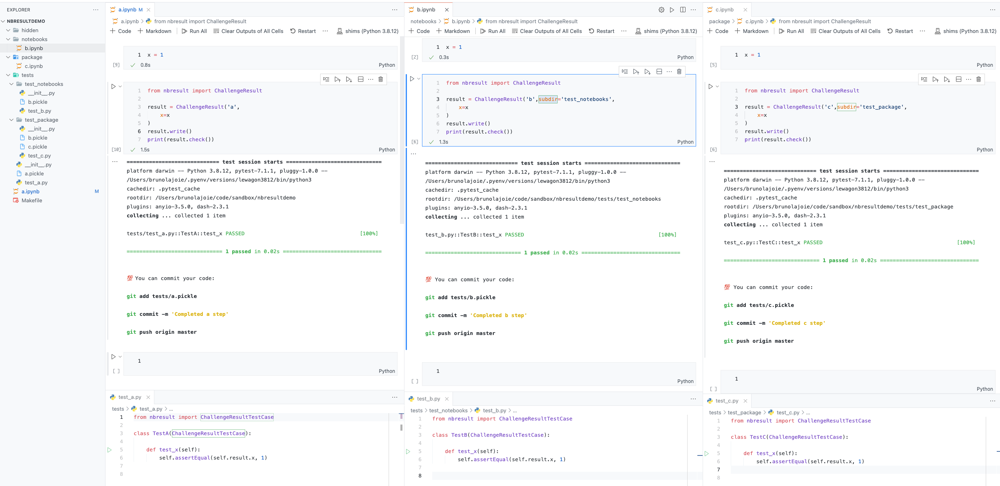

# nbresult

A simple package to test Jupyter notebook result for the Le Wagon's Data Science Bootcamp.

## 1. Installation

Installation with `pip` from [Pypi](https://pypi.org/):

```bash
pip install nbresult
```

## 2. Usage

### 2.1 Basic usage
Considering the default data challenge architecture:

```bash
.
├── challenge.ipynb
├── Makefile
├── README.md
├── data
│   └── data.csv
└── tests
    └── __init__.py
```

If you want to test a variable `log_model_score` from the `challenge.ipynb` notebook with `pytest`:



Anywhere in the notebook you can add a cell with the following code:

```python
from nbresult import ChallengeResult

result = ChallengeResult('score',
    score=log_model_score
)
result.write()
```

This outputs a `score.pickle` file in the `tests` directory:

```bash
.
├── challenge.ipynb
├── Makefile
├── README.md
├── data
│   └── data.csv
└── tests
    ├── __init__.py
    └── score.pickle
```

Now you would like to write test on the `log_model_score` with `pytest`. Create a `test_score.py` file:

```python
# tests/test_score.py
from nbresult import ChallengeResultTestCase


class TestScore(ChallengeResultTestCase):

    def test_score_is_above_82(self):
        self.assertEqual(self.result.score > 0.82, True)
```

Finally you can run your tests with `pytest`:

```bash
pytest tests/test_score.py
```



OR

Run the tests with `make`:
- Setup a `Makefile`

```make
# Makefile

default: pytest

pytest:
  PYTHONDONTWRITEBYTECODE=1 pytest -v --color=yes
```

- Run `make`



OR

Run the tests inside the notebook:

```python
from nbresult import ChallengeResult

result = ChallengeResult('score',
    score=log_model_score
)
result.write()
print(result.check())
```



### 2.2 Advanced usage
For more advanced folder structure, you also can specify a `subdir` folder in which store & read pickle file

```python
from nbresult import ChallengeResult

result = ChallengeResult('score',
    subdir='a', # This will store pickle in tests/a/score.pickle
    score=log_model_score
)
result.write()
result.check()
```

Check out detailed example below



## Testing

Run `make`
