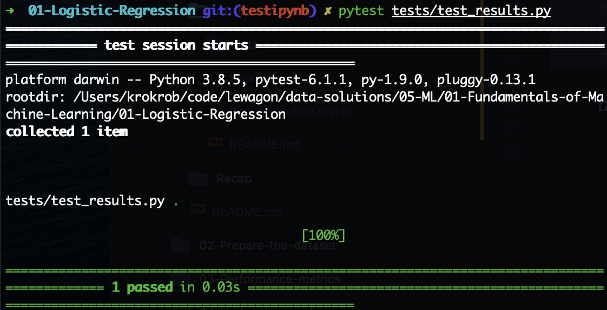
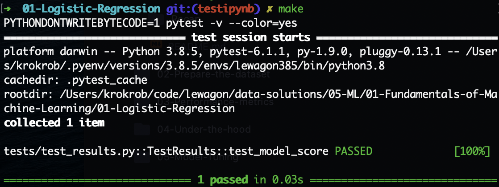

# nbresult

A simple package to test Jupyter notebook result for the Le Wagon's Data Science Bootcamp.

## Installation

Installation with `pip` from GitHub:

```bash
pip install git+https://github.com/lewagon/nbresult.git
```

**OR**

Manual installation:
- Download the package
- Go to the package directory
- Install the package with

```bash
pip install .
```

## Usage

Considering the default data challenge architecture:

```bash
.
├── challenge.ipynb
├── Makefile
├── README.md
├── data
│   └── data.csv
└── tests
    ├── __init__.py
    ├── test_notebooks.py
    └── test_results.py
```

If you want to test a variable `log_model_score` from the `challenge.ipynb` notebook with `pytest`:


At the end of the notebook add a cell with the following code:

```python
from nbresult.challenge_result import ChallengeResult


RESULT = ChallengeResult(
    score=log_model_score
)
RESULT.write()
```

This outputs a `results.json` file in the `tests` directory:

```json
# tests/results.json

{
  "score": 0.829004329004329
}
```

The notebook results can be imported from anywhere with:

```python
from nbresult.challenge_result import ChallengeResult


results = ChallengeResult().load('path/to/results.json')
```

So you can write test the `log_model_score` with `pytest`:

```python
# test_results.py

import unittest
import os
from nbresult.challenge_result import ChallengeResult


class TestResults(unittest.TestCase):
    results = ChallengeResult().load(os.path.join(
        os.path.dirname(__file__),
        'results.json')
    )

    def test_model_score(self):
        self.assertEqual(self.results['score'] > 0.82, True)
```

Finally you can run your tests with `pytest`:

```bash
pytest tests/test_results.py
```



OR

Run the tests with `make`:
- Setup a `Makefile`

```make
# Makefile

default: pytest

pytest:
  PYTHONDONTWRITEBYTECODE=1 pytest -v --color=yes
```

- Run `make`


